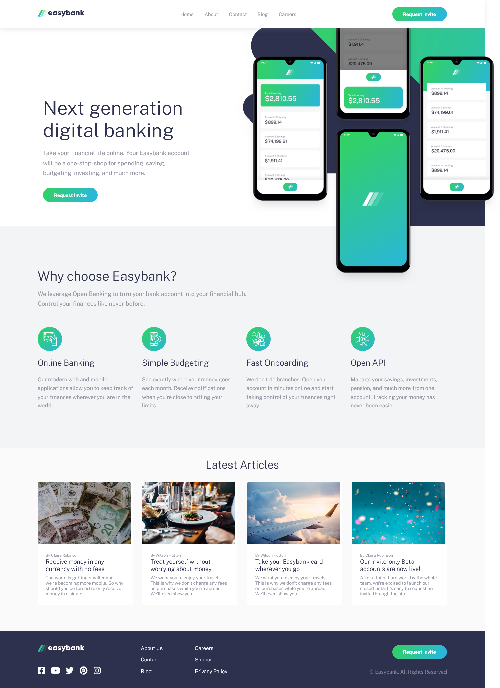

# Frontend Mentor - Easybank landing page solution

This is a solution to the [Easybank landing page challenge on Frontend Mentor](https://www.frontendmentor.io/challenges/easybank-landing-page-WaUhkoDN). Frontend Mentor challenges help you improve your coding skills by building realistic projects.

An easy-ish challenge at first glance but I had a lot more trouble with it than I initially thought. Apart from having some accessibility concerns (markup for article links, svgs), it has a pretty complicated layout (with the overlapping image in the hero section, for example). It was a real challenge to make it look good on all screen sizes.

## Table of contents

- [Overview](#overview)
  - [The challenge](#the-challenge)
  - [Screenshot](#screenshot)
  - [Links](#links)
- [My process](#my-process)
  - [Built with](#built-with)
  - [What I learned](#what-i-learned)
  - [Continued development](#continued-development)
  - [Useful resources](#useful-resources)
- [Author](#author)
- [Acknowledgments](#acknowledgments)

## Overview

### The challenge

Users should be able to:

- View the optimal layout for the site depending on their device's screen size
- See hover states for all interactive elements on the page

### Screenshot

### Links

- [Live site](https://easybank-page-vanilla.netlify.app/)

## My process

### Built with

- Semantic HTML5 markup
- CSS custom properties
- Flexbox
- Mobile-first workflow

### What I learned

_Easybank logo - using SVG_

I usually wrap my SVGs in an  tag. In this challenge however, Easybank logo was coloured differently in the header and footer sections so I had to go with using an inline SVG which allowed me to make the necessary changes. Apart from being a bit hard on the eyes, an inline SVG comes with a few accessibility issues, I found (like not having an alternative text description, which you may not even be warned of, since its not an  but an <svg>). I followed a CSS-Tricks article on the topic (link in resources) and added a role="img" and an aria-labelledby that points to the title and description that provides an alternative text. I suppose, this wasn't hugely important in a case of a logo (perhaps I could've just hidden it, as there was another logo in the header already), but it was a good opportunity to learn about accessible SVGs. ^^

_Further accessibility_

I learned about keyboard navigation fairly recently and since then I pay attention to adding custom focus indicators to all projects. Since this project has a very pretty linear-gradient colour theme, I thought I use it for the focus indicators as well. Turns out it's not possible. :( Too bad really, would've been great.

Few weeks ago I came across Kevin Powell's video (link in resources) on hidden Skip navigation buttons. Never thought of this before (I don't really navigate through websites with keyboard, unless I'm testing something) but it's pretty smart so I included a button in this challenge (and will do it in future projects, for sure).

_Intersection observer, animations_

I added some subtle fade in animations with css keyframes and intersection observer.

### Continued development

The mobile menu still feels a bit wonky so a bit of work needed on that in the future.

### Useful resources

- [CSS-Tricks: Accessible SVGs](https://css-tricks.com/accessible-svgs/)
- [Kevin Powell's video on skip navigation button](https://www.youtube.com/watch?v=jDDaOFr9nqQ)
- [Scott O'Hara: Accessibility of the section element](https://www.scottohara.me/blog/2021/07/16/section.html) - not strictly related to this project but I found it interesting, so I'll leave a link here
- [Web Dev Simplified: Intersection Observers](https://www.youtube.com/watch?v=2IbRtjez6ag) - very easy-to-follow video on intersection observers
- [MDN: Intersection Observer API](https://developer.mozilla.org/en-US/docs/Web/API/Intersection_Observer_API)

## Author

- Frontend Mentor - [@FluffyKas](https://www.frontendmentor.io/profile/FluffyKas)

## Acknowledgements

Lots of thanks to @abedfetrat from Frontend Mentor for giving me a tip about overflow-x: clip which I used to solve the problems with the hero section layout!
